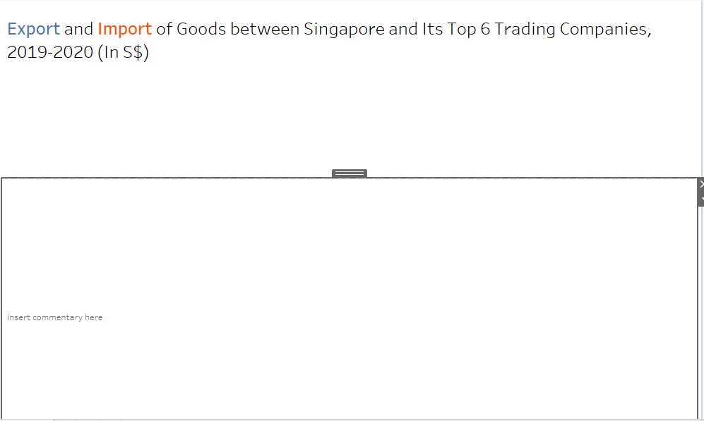

```{r setup, include=FALSE}
knitr::opts_chunk$set(echo = FALSE)
```

  <h2>Critique of Visualization</h2>
  <dt-byline></dt-byline>
  
  <p>For this makeover, the original visualization can be seen below.</p>
  

 {width=1000}
  
  <h3>Clarity</h3>
  
  <p>
  1.	The title of the visualization does not clearly convey what kind of information it is trying to give. While it is true the graph represents merchandise trade, it does not state which country is trading with those six countries. Furthermore, no explanation on what currency is used as its unit leaves the numbers meaningless to the readers.
2.	In addition, the y-axes are in the millions while looking at the data the values are in billions. Thereby revealing that the visualization fails to mention that the values are divided by 1 thousand anywhere in the title.
3.	The x-axis says “month of period” which would imply the dataset is a monthly time series. However, the values used in that axis is instead the years with no specific starting and ending months.
4.	Low data ink ratio from the area chart makes it hard for readers to infer what the chart is trying to inform.
5.	5 of the 6 countries visualized has the same range of export and import values (millions). However, the ticks of the y-axes are not in the same height which may lead to readers falsely assuming that export and import at a certain time are equal while the reality is far from it. In addition, the difference in height between the countries would make it hard for readers to see which countries are trading more than the others (e.g. the graph would imply that Japan and China are equal trading partners to Singapore based on the graph height. However, looking at the numbers the 2 countries have a difference of over 4 billion SGD in monthly merchandise trading).  
6.	No source of data gives the graph less credibility to the readers.
7.	No annotations to further communicate what the graph is trying to explain to the readers.
</p>
  
  
  <h3>Aesthetics</h3>
  
  <p>
  1.	Choice of words in graph title using “merchandise trade” makes it harder for the average reader to understand. 
2.	The choice to fill the graph color all the way down to the x-axis makes it hard for readers to see the values especially when the Import graph is higher than the Export graph.
3.	Using dual axis on the same magnitude and unit makes it redundant.
4.	No tick marks on the x-axis despite being a continuous data.
5.	Title of the y-axes are placed vertically, making It hard for viewers to read.
6.	Placement of legend at the far right makes readers hard to continually identify which color represent each dataset.
</p>
  
  <h2> Makeover Proposal Sketch </h2>
  <p>
  Based on the issues identified in the previous section, an improved visualization can be developed that addresses the listed problems. A sketch of the graph model can be seen in the figure below.
  </p>
  
  {width=1000}
  
  <h3> Clarity </h3>
  <p>
  1.	The title has been changed to reflect the data presented. The graph shows the trades happening between Singapore and its top 6 trading countries. In addition, the unit of numbers are also added to give clarity on what currency is used for the data.
2.	The y-axis range has been changed to Billions as is the real dataset is to eliminate confusion of the true value of trades happening.
3.	Tick marks in x-axis changed from yearly to monthly.
4.	High data ink ratio from eliminating the area makes it easy for readers to infer the values.
5.	Label height for both y-axes have been standardized to 0-8 billion SGD. This is done such that not only the export and import values of one graph can be more easily distinguished, but the values from one country graph to another can also be immediately compared without consulting the labels for each country graph.
6.	The source of data which is Singapore government’s Department of Statistics is added to give credibility to the visualization.
7.	Annotations are added to any points of interest found to give a deeper understanding to the readers.
8. Order of appearance sorted based on magnitude for ease of comparison
  </p>
  
  <h3> Aesthetics </h3>
  
  <p>
  1.	“Merchandise trade” has been changed to “Export and Import of Goods”. While “Merchandise Trade” is the correct terminology used by WTO, “Export and Import of Goods” is also a correct term which has the same meaning and is also more widely understood by the average readers.
2.	The line graph is not filled to the bottom to make the graphs easier to read.
3.	Only 1 axis is used considering both exports and imports are in the billions SGD magnitude and unit to eliminate redundancy.
4.	Tick marks added to the x-axis in accordance with added labels discussed in the Clarity sub-section.
5.	Titles of the y-axes are rotated to horizontal for ease of reading.
6.	The legends are incorporated into the dashboard title to give readers a faster way to reference the colors while also adding aesthetic features to the title.
</p>

<h2> Proposed Visualization </h2>

<p>
The proposed visualization improvement can be seen in Tableau Public [Here.](https://public.tableau.com/app/profile/fady.ganis/viz/DataVizMakeover1_16223118434150/Dashboard1  "Tableau Public - DataViz Makeover 1")
</p>

<h2> Steps Documentation </h2>

<h3> Data Preparation </h3>
<p>
Before any visualizations can be made, some data preparations must first be conducted using Tableau Desktop. The steps taken include:
</p>

<p>
1. Import the dataset to Tableau. Click on the “Microsoft excel” option in the connect data pane.


2. Select the dataset file.


3. Drag the T1 sheet to the “drag tables here” part of the screen.

{width=1000}

4. On the left side of the screen, tick the “data interpreter” to skip the rows containing the title of the sheet.


5. In the top right side, click on the “filters”, then “Add..”, then “variables” and select the 6 countries that will be visualized.


6. On the fields that are not the years used, highlight all of them and right click then click hide.

{width=1000}

7. Highlight all columns except for “Variables”, right click one of the highlighted column and click on pivot.


8. Rename the pivoted fields.


9. Change the type of “Month” field from “string” to “date”.


10. In the Import field, click “Create Calculated Field” and set code to multiply by 1000 to eliminate (in thousands) clarifier

{width=1000}

11. In the “Variables” field, click on “create calculated field” with the shown formula to remove the “(Thousands Dollar)” part of the country.

{width=1000}

12. In the “worksheet” window, select “Data” menu, then “New Data Source” select the dataset and repeat the steps for the T2 sheet.

{width=1000}

13. Go to “Data” menu, then click on “Edit Blend Relationships” to check if both data sources have been matched in the “Month” and “Variables” fields and then click “OK”.


14. Make sure the data is linked in “Country” and “Month”, the data is linked if the icon is red


</p>

<H3> Graph Creation </H3>

<p>
With the data fully cleaned and connected, the graphs can then be created with the following steps.
</p>

<p>
1. Drag “Country” and “Month” fields to columns pane and “Export” and “Import” to rows pane. Then on the right axis, right click and choose “Synchronize Axis” and deselect “Show Header”. Then set month format to “Month/Year” and fit the graph by width.


2. Edit Axis” the left axis and delete the title


3. In the “Rows” section, double click and type “Merchandise Trade (S$)”


4. Right click on the top part of “Merchandise Trade (S$)” and “Country/Month” and click “Hide Field Labels for Rows” and “Hide Field Labels for Columns”, respectively.


</p>

<h3> Dashboard Creation </h3>

With the visualization created, the dashboard can be built by clicking the "New Dashboard" button.

1. In a new dashboard, drag text object to the dashboard and type the title

{width=1000}

2. Drag another text object below the title to provide space for commentary later

{width=1000}

3. Drag the worksheet below the commentary box and adjust the proportion between the 3 objects


4. When creating annotations, right click the box and select “Format”, change the shading to a low percentage to allow y-axis label marks to be seen and select a line color that is visible


5. Write annotations and comment, as well as drag the graphs around to sort by magnitude

{width=1000}

6. Drag text object at bottom of dashboard and add source of data

{width=1000}

<h2> Generated Insights </h2>

<p>
1.	A sharp jump in exports from February 2020 to April 2020 for 3 of the 6 countries (Mainland China, United States, and Hong Kong) as well as a slight rise for another 2 (Japan and Taiwan) may be in most parts due to a high influx of demand for pharmaceuticals and medical supplies caused by Covid-19. [StraitsTimes](https://www.straitstimes.com/business/economy/singapore-non-oil-exports-rise-for-a-third-month-in-april-defying-covid-19  "Singapore non-oil exports rise for a third month in April despite Covid-19 gloom")
2.	In January – April 2020, Malaysia experiences a sharp decline in export and import with Singapore due to shutdown of its many key economic sectors due to the pandemic, creating the worst slump in trade for the constitutional monarchy since the 2008 financial crisis. [TheEdgeMarkets](https://www.theedgemarkets.com/article/malaysias-exports-suffer-worst-slump-11-years "Malaysia's exports suffer worst slump in 11 years") , [Malaysia Department of Statistics](https://www.dosm.gov.my/v1/index.php?r=column/pdfPrev&id=bXF1OFR3YW1XNXRuMlMyNGNlSUthZz09#:~:text=The%20two%20main%20sources%20of,when%20compared%20to%20April%202019 "Malaysia External Trade Statistics April 2020 Press Release")
3.	With china starting to recover by late 2020, August 2020 saw the largest export to china mostly in non-oil products due to rising demands, a 104% increase from January 2020. [BloombergQuint](https://www.bloombergquint.com/global-economics/singapore-s-export-growth-accelerates-as-china-demand-picks-up "Singapore’s Export Growth Accelerates as China Demand Picks Up")
</p>

