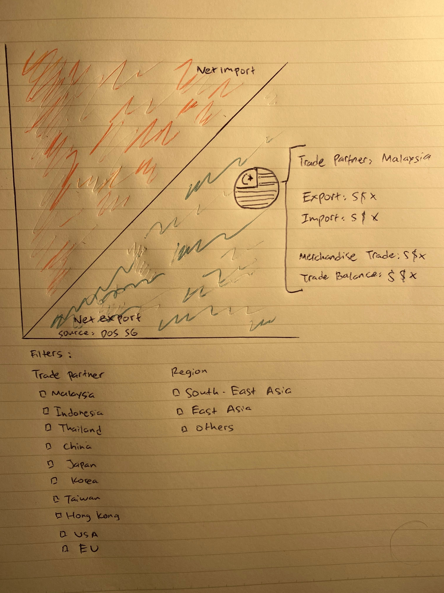
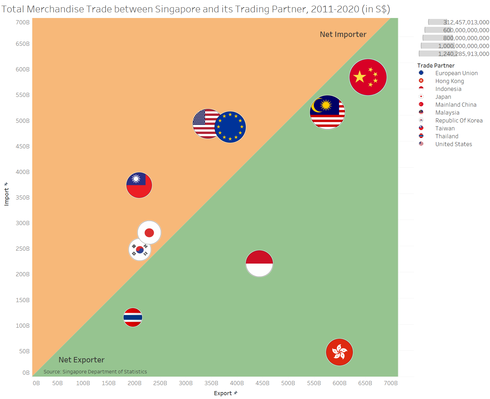
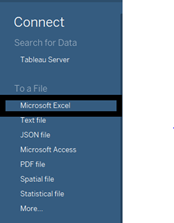
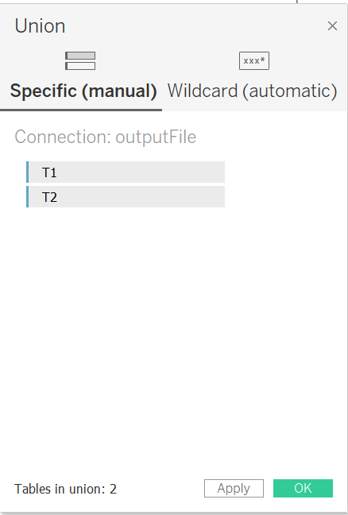
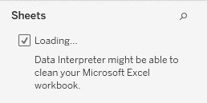

```{r setup, include=FALSE}
knitr::opts_chunk$set(echo = FALSE)
```

<h2>Introduction</h2>
  <dt-byline></dt-byline>
  
  <p>For this makeover, the task at hand is to critique a bubble chart which represents the total trade happening between Singapore and 10 of its trading partners between 2011-2020</p>
  
  <p>The steps taken is to first identify what was done wrong in the given visualization, sketch the plan on how to improve it, and then create the improvement using Tableau Desktop.</p>
  

<h2>Critique of Visualization</h2>
  <dt-byline></dt-byline>
  
  <p>For this makeover, the original visualization can be seen below.</p>
  ```{r, echo=FALSE, out.width="550",out.height="650", fig.cap="original visualization"}
knitr::include_graphics("orisketch/ori.jpg")
```

<p>The bubble chart above shows a relationship of 3 variables between Singapore and some of its trading partners which are the total import shown in the y-axis, the total export shown in the x-axis, and the total merchandise trade represented by the size of each bubble. In addition, the placement of the center of each bubble shows whether the relationship between Singapore and that partner is if Singapore is a net importer, net exporter or is balanced with that specific partner.</p>

<p>Looking initially at the graph, some critiques can be given based on its clarity and aesthetic which will be discussed further in this section.</p>

<h3> Clarity </h3>
<p>
1.	Missing graph title makes readers hard to instantly understand what the bubble chart shows.
2.	No specific explanation as to what the label next to each bubble is, further contemplation with relation to the size of bubble mentioned in a small note results in the conclusion that the label shows the total trade (export + import).
3.	No clarification as to by how much Singapore has a surplus (if net exporter) or deficit (if net importer) with its trading partners.
</p>

<h3> Aesthetic </h3>
<p>
1.	Too many partners clumped together makes it hard to see the exact placement of bubbles.
2.  Using colour code to label trade partners makes it unintuitive
3.	Bubbles covered by annotations of a partner next to it makes it difficult to see if that bubble is in a net importer or net exporter region.
4.	Blue and green background to show a trade surplus or deficit is not ideal since both colors generally represent a positive tone.
</p>

<h2> Makeover Proposal Sketch </h2>
  <p>
  Based on the issues identified in the previous section, an improved visualization can be developed that addresses the listed problems. A sketch of the graph model can be seen in the figure below.
  </p>
  
  ```{r, echo=FALSE, out.width="500",out.height="650", fig.cap="sketch of improvement"}

```

  <h3> Clarity </h3>
  <p>
  1.	Added title to clearly convey what the chart is aiming to inform.
  2.  Annotations turned into tooltips to not take up space when information not needed.
  3.  Trade balance added as info to tooltip.
  </p>
  
  <h3> Aesthetics </h3>
  
  <p>
  1.	Size of bubble and axes adjusted to avoid too much parts clumped together
  2.  Bubble uses flags of each partner instead for more instantaneous recognizition by readers.
  3.  annotations changed to tooltips
  4.  Region color changed to orange (for net import) and green (for net export) for a more intuitive color code of having a negative or positive trade balance.
</p>

<h2> Proposed Visualization </h2>

```{r, echo=FALSE, out.width="500",out.height="650", fig.cap="sketch of improvement"}

```

<p>
Above is a static image of the visualization improvement. An interactive version can be seen in Tableau Public [Here.](https://public.tableau.com/app/profile/fady.ganis/viz/DataVizMakeover2-AhmadFadyGanis/TotalMerchandiseTrade  "Tableau Public - DataViz Makeover 2")
</p>

<h2> Steps Documentation </h2>

<h3> Data Preparation </h3>
Before any visualizations can be made, some data preparations must first be conducted using Tableau Desktop. The steps taken include:

<p>
1. Import the dataset to Tableau. Click on the “Microsoft excel” option in the connect data pane.
</p>

```{r, echo=FALSE, out.width="175",out.height="250", fig.cap="import excel file."}

```

2. Select the dataset file.

```{r, echo=FALSE, out.width="450",out.height="350", fig.cap="import excel file."}
knitr::include_graphics("prep/prep2.png")
```

3. Drag “New Union” to the data prep sheet and select the T1 and T2 sheets.

```{r, echo=FALSE, out.width="450",out.height="500", fig.cap="union of the 2 worksheets"}

```

4. On the left side of the screen, tick the “Data Interpreter” to skip the rows containing the title of the sheet.

```{r, echo=FALSE, out.width="250",out.height="150", fig.cap="enable 'Data Interpreter'"}

```

5. In the top right side, click on the “filters”, then “Add..”, then “variables” and select the 10 trading partners that will be visualized.

```{r, echo=FALSE, out.width="250",out.height="350", fig.cap="filter the used trade partners"}
knitr::include_graphics("prep/prep5.png")
```

6. On the fields that are not the years used (ie. not between 2011-2020), highlight all of them and right click then click hide.

```{r, echo=FALSE, out.width="525",out.height="250", fig.cap="hide months outside of used range"}
knitr::include_graphics("prep/prep6.png")
```

7. Highlight all columns except for “Variables”, “Sheet” and “Table Name” fields, then right click one of the highlighted column and click on “Pivot”.

```{r, echo=FALSE, out.width="425",out.height="450", fig.cap="pivot the month fields"}
knitr::include_graphics("prep/prep7.png")
```

8. The “Import” and “Export” fields are still combined and must first be separated. First create the “Import” Field using this calculation.

```{r, echo=FALSE, out.width="425",out.height="150", fig.cap="import calculation"}
knitr::include_graphics("prep/prep8.png")
```

9. The “Export” field uses a similar calculation.

```{r, echo=FALSE, out.width="425",out.height="150", fig.cap="export calculation"}
knitr::include_graphics("prep/prep9.png")
```

10. In the “Variables” field, click on “create calculated field” with the shown formula to remove the “(Thousands Dollar)” or “(Million Dollar)” part of the name.

```{r, echo=FALSE, out.width="425",out.height="150", fig.cap="clean the trade partner name"}
knitr::include_graphics("prep/prep10.png")
```

11. Create a “Merchandise Trade” field by adding “Import” and “Export”.

```{r, echo=FALSE, out.width="425",out.height="150", fig.cap="create merchandise trade field"}
knitr::include_graphics("prep/prep11.png")
```

<h3> Background Creation </h3>
<p>
For this graph, the background will be divided into 2 regions, net importer and net exporter. Therefore, a background with such a color scheme will be first created to be loaded into the visualization as a background image. The steps are listed as follow. </p>

1. Create an excel file with the fields “position”, “import” , “export” and “stat”. Position refers to points of angle in which this case the background will be divided into 2 triangles, hence 3 positions for each status. The import and export would be the maximum and minimum value in each corresponding axes.

```{r, echo=FALSE, out.width="425",out.height="150", fig.cap="created excel file"}
knitr::include_graphics("background/bg1.png")
```

2. Import the file into Tableau.

```{r, echo=FALSE, out.width="425",out.height="250", fig.cap="file selected to import"}
knitr::include_graphics("background/bg2.png")
```

3. Drag the fields into the appropriate axes.

```{r, echo=FALSE, out.width="450",out.height="350", fig.cap="fields dragged to row and column"}
knitr::include_graphics("background/bg3.png")
```

4. Drag the “stat” field into the “color” mark.

```{r, echo=FALSE, out.width="450",out.height="350", fig.cap="stat field added to mark"}
knitr::include_graphics("background/bg4.png")
```

5. In the “Analysis” pane, un-tick the “Aggregate Measures” option.

```{r, echo=FALSE, out.width="250",out.height="275", fig.cap="disable the 'Aggregate Measures'"}
knitr::include_graphics("background/bg5.png")
```

6. Change the mark type from “Automatic” to “Polygon” and drag the “Stat” field into “Path”.

```{r, echo=FALSE, out.width="450",out.height="350", fig.cap="background created"}
knitr::include_graphics("background/bg6.png")
```

7. Export the chart as a .png extension with only “view” ticked.

```{r, echo=FALSE, out.width="250",out.height="150", fig.cap="file export settings"}
knitr::include_graphics("background/bg7.png")
```

<h3> Flag Icons Creation </h3>
<p>
On top of backgrounds, the bubble of each trading partner will also feature its flag. Therefore, custom shapes must also be created using Microsoft word and images of the flags found online. The steps are done as follow.
</p>
1. In Microsoft Word, create a circle shape

```{r, echo=FALSE, out.width="300",out.height="250", fig.cap="circle shape"}
knitr::include_graphics("flag/flag1.png")
```

2. Right click the object then select “Fill” and then click on “Picture”

```{r, echo=FALSE, out.width="300",out.height="250", fig.cap="fill circle with picture"}
knitr::include_graphics("flag/flag2.png")
```

3. Select the image file

```{r, echo=FALSE, out.width="350",out.height="250", fig.cap="image file selected"}
knitr::include_graphics("flag/flag3.png")
```

4. Right click on the object select “Format Shape” and set the placement and sharpness until the image fits the circle and looks good.

```{r, echo=FALSE, out.width="400",out.height="350", fig.cap="fixed image proportions"}
knitr::include_graphics("flag/flag4.png")
```

5. Right click the object and select “Save as Picture”

```{r, echo=FALSE, out.width="350",out.height="250", fig.cap="save object as image"}
knitr::include_graphics("flag/flag5.png")
```

6. Choose the directory My Documents > My Tableau Repository > Shapes then create a new folder and save the image on that new folder

```{r, echo=FALSE, out.width="500",out.height="350", fig.cap="file save path"}
knitr::include_graphics("flag/flag6.png")
```

7. Repeat the steps for all flags needed

```{r, echo=FALSE, out.width="500",out.height="350", fig.cap="flag icons for all partners"}
knitr::include_graphics("flag/flag7.png")
```

<h3> Chart Creation </h3>

<p>With the data fully cleaned and connected as well as the background region and flag icons created. The chart can then be created with the following steps.</p>
<p>
1. Drag the “Export” and “Import” fields to the “Columns” and “Rows” section, respectively.

```{r, echo=FALSE, out.width="250",out.height="100", fig.cap="placement of fields"}
knitr::include_graphics("chart/chart1.png")
```

2. Drag the “Trade Partner” field to the “Shape” mark.

```{r, echo=FALSE, out.width="250",out.height="300", fig.cap="trade partners dragged to shape mark"}
knitr::include_graphics("chart/chart2.png")
```

3. Left click on shape, select the custom-made shape palette and assign each flag to its corresponding partner

```{r, echo=FALSE, out.width="350",out.height="300", fig.cap="assignment of flags"}
knitr::include_graphics("chart/chart3.png")
```

4. Drag the “Merchandise Trade” field to the size mark and adjust the slider to a proper level.

```{r, echo=FALSE, out.width="450",out.height="300", fig.cap="adjustment of size"}
knitr::include_graphics("chart/chart4.png")
```

5. To add the background image, first go to Map > Background Images > Union.

```{r, echo=FALSE, out.width="300",out.height="200", fig.cap="add background image path"}
knitr::include_graphics("chart/chart5.png")
```

6. In the “add image” section, browse for the exported background and set the max value in the x-axis and y-axis to 750B.

```{r, echo=FALSE, out.width="350",out.height="350", fig.cap="add background image"}
knitr::include_graphics("chart/chart6.png")
```

7. On the x and y axes, set the limit to 700B.

```{r, echo=FALSE, out.width="350",out.height="450", fig.cap="set axis range"}
knitr::include_graphics("chart/chart7.png")
```

8. Add Area Annotations to mark the regions for “Net Importer” and “Net Exporter”

```{r, echo=FALSE, out.width="500",out.height="450", fig.cap="region annotations added"}
knitr::include_graphics("chart/chart8.png")
```

9. In the “Trade Partner” field, select create > group

```{r, echo=FALSE, out.width="300",out.height="450", fig.cap="create new group"}
knitr::include_graphics("chart/chart9.png")
```

10. Create groups by CTRL click the partners then press group and name the group based on the regions. Also tick the “Include Other” box to group USA and EU.

```{r, echo=FALSE, out.width="300",out.height="350", fig.cap="group partners by region"}
knitr::include_graphics("chart/chart10.png")
```

11. Rename the group to “Region” then drag the group and the “Trade Partner” field to filters.

```{r, echo=FALSE, out.width="250",out.height="200", fig.cap="group renamed and added to filters"}
knitr::include_graphics("chart/chart11.png")
```

12. In the “Export” field, right click and select create calculated field with the following formula

```{r, echo=FALSE, out.width="425",out.height="150", fig.cap="trade balance calculation"}
knitr::include_graphics("chart/chart12.png")
```

13. Drag the newly created field to “Tooltip” mark

```{r, echo=FALSE, out.width="250",out.height="300", fig.cap="trade balance added to tooltip"}
knitr::include_graphics("chart/chart13.png")
```

14. Format the placement of the tooltips to create an even lining with each other.

```{r, echo=FALSE, out.width="350",out.height="300", fig.cap="format placement of tooltips"}
knitr::include_graphics("chart/chart14.png")
```

15. Rename the title of the chart

```{r, echo=FALSE, out.width="500",out.height="450", fig.cap="title properly renamed"}
knitr::include_graphics("chart/chart15.png")
```

16. Add another annotation for the source of data

```{r, echo=FALSE, out.width="200",out.height="150", fig.cap="source added"}
knitr::include_graphics("chart/chart16.png")
```

<h2> Generated Insights </h2>
From the chart created, useful information about Singapore's trade can be inferred. Some of the more interesting findings are listed below.

1. In general, Singapore has net import trade relationships with developed countries (Japan, USA, EU, Korea) while having net export trade relationships with developing countries (Indonesia, Malaysia, Thailand).

2. In relation to the ["Gravity Model of Trade"](https://oxfordre.com/economics/view/10.1093/acrefore/9780190625979.001.0001/acrefore-9780190625979-e-327  "Oxford Research"), which states an entity will trade more in relative to a partner's size and proximity. Singapore's biggest trade partners are geographically farther (e.g., EU, USA, China) while it trades less with nearer countries (i.e., Indonesia and Thailand), making it seem that Singapore leans more to the economic size of a partner than the proximity.  Malaysia, which is Singapore's nearest neighbor country is the only exception.

3. Singapore’s imports primarily include machinery and equipment, mineral fuels, chemicals, food and consumer goods [ASEAN Briefing](https://www.aseanbriefing.com/regions/singapore  "ASEAN Briefing from Dezan Shira & Associates"). This would explain why regions abundant in natural resources (e.g., USA, Malaysia, China, EU) would have higher import trades happening, albeit not necessarily making Singapore a net importer to them, while regions with little natural resources such as Thailand and Hong Kong have a much lower import value compared to how much Singapore exports to them.